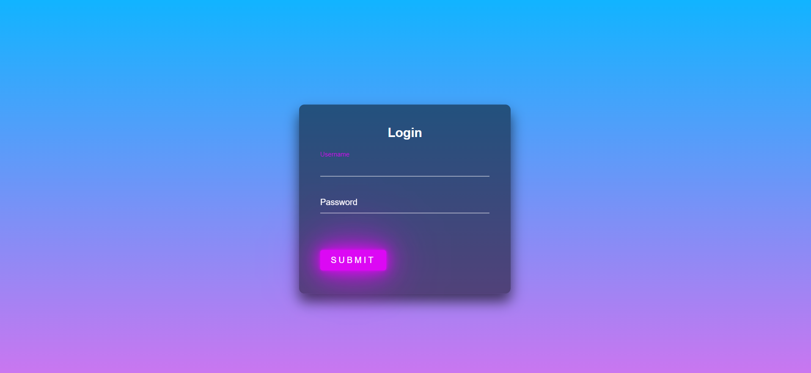

# Login Form Project

 <!-- You can add a screenshot of the login form here -->

Welcome to the Login Form project! This is a simple web-based application that demonstrates the implementation of a secure user login form. The project utilizes HTML, CSS, and JavaScript to create an interactive and user-friendly login interface.

## Table of Contents

- [Overview](#overview)
- [Features](#features)
- [Usage](#usage)
- [Contact](#contact)

## Overview

The Login Form project showcases a basic user login form with a clean and modern design. It provides a secure way for users to authenticate and access a restricted area of a website or application. The form is responsive and works well on various devices, ensuring a seamless user experience.

## Features

- User-friendly and responsive login form.
- Secure authentication with input validation.
- Customizable and easy to integrate into any web application.

## Usage

To use the login form, simply follow these steps:

1. Clone or download this repository to your local machine.
2. Open the `index.html` file in your web browser.
3. Enter your username and password in the respective fields.
4. Click the "Login" button to submit the form.

Feel free to customize the login form according to your project's requirements. You can change the design, add additional fields, or integrate it into your existing web application.

## Contact

You can reach me via the following social accounts:

- LinkedIn: [linkedin.com/in/hilalsalarzi](https://www.linkedin.com/in/hilalsalarzi)
- Twitter: [twitter.com/hilalsalarzi](https://twitter.com/hilalsalarzi)
- GitHub: [github.com/hilalsalarzi](https://github.com/hilalsalarzi)
- Instagram: [instagram.com/hilalsalarzi](https://www.instagram.com/hilalsalarzi/)

If you have any questions, feedback, or suggestions about this project, feel free to contact me through any of the above channels. I'm always happy to hear from fellow developers and enthusiasts.

---

Thank you for exploring the Login Form project! Happy coding! 🚀

